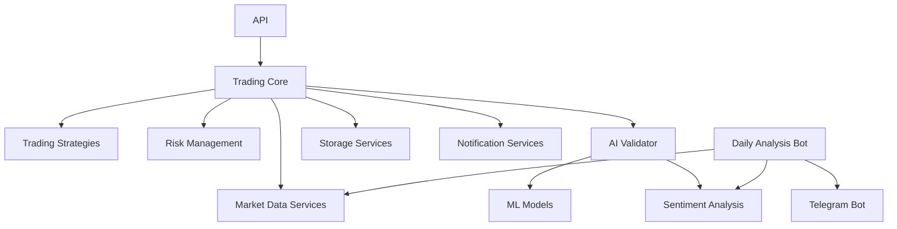

# 🏗️ EVIL2ROOT Trading Bot - Architecture et Extension

Ce document détaille l'architecture interne d'EVIL2ROOT Trading Bot et fournit des conseils pour l'extension et la personnalisation du système.

## Table des matières

1. [Architecture du code](#architecture-du-code)
2. [Flux de données](#flux-de-données)
3. [Extension du système](#extension-du-système)
   - [Création de stratégies personnalisées](#création-de-stratégies-personnalisées)
   - [Ajout de nouveaux indicateurs](#ajout-de-nouveaux-indicateurs)
   - [Intégration d'un nouvel exchange](#intégration-dun-nouvel-exchange)
   - [Création de plugins](#création-de-plugins)
4. [Bonnes pratiques](#bonnes-pratiques)
5. [Études de cas](#études-de-cas)

## Architecture du code

### Vue d'ensemble des composants

Le système EVIL2ROOT est organisé en plusieurs composants clés qui interagissent entre eux :

```
EVIL2ROOT_AI/
│
├── src/                    # Code source principal
│   ├── core/               # Moteur principal du système
│   │   ├── trading.py      # Système de trading central
│   │   ├── risk.py         # Gestion des risques
│   │   └── strategies/     # Stratégies de trading
│   │
│   ├── models/             # Modèles d'IA et ML
│   │   ├── price_prediction/  # Prédiction de prix
│   │   ├── sentiment/      # Analyse de sentiment
│   │   └── rl/             # Apprentissage par renforcement
│   │
│   ├── services/           # Services internes et externes
│   │   ├── market_data/    # Services de données de marché
│   │   ├── notification/   # Services de notification
│   │   └── storage/        # Services de stockage
│   │
│   ├── validators/         # Validation des décisions
│   │   └── ai_trade_validator.py  # Validateur IA
│   │
│   ├── api/                # API externes
│   │   ├── routes/         # Routes API
│   │   └── models/         # Modèles de données API
│   │
│   └── utils/              # Utilitaires
│       ├── log_config.py   # Configuration des logs
│       └── env_config.py   # Configuration d'environnement
│
├── app/                    # Applications spécifiques
│   ├── daily_analysis_bot.py  # Bot d'analyse quotidienne
│   ├── telegram_bot.py     # Bot Telegram
│   └── plugins/            # Système de plugins
│
├── config/                 # Configuration
├── scripts/                # Scripts utilitaires
└── data/                   # Données et modèles sauvegardés
```

### Interactions entre composants



### Classes principales et leurs relations

- **TradingSystem** (`src/core/trading.py`) : Classe centrale qui orchestre tout le système
- **AITradeValidator** (`src/validators/ai_trade_validator.py`) : Valide les décisions de trading
- **PricePredictionModel** (`app/models/price_prediction.py`) : Modèles de prédiction de prix
- **SentimentAnalyzer** (`app/models/sentiment_analysis.py`) : Analyse le sentiment du marché
- **RiskManagementModel** (`app/models/risk_management.py`) : Gère les risques et tailles de position
- **MarketDataService** (`src/services/market_data/`) : Fournit les données de marché
- **PluginManager** (`app/plugins/plugin_manager.py`) : Gère les plugins du système

## Flux de données

### Acquisition des données

1. Les données de marché sont récupérées via les connecteurs d'exchange (`src/services/market_data/`)
2. Les données sont normalisées et enrichies avec des indicateurs techniques
3. Les données historiques sont stockées en base de données pour backtesting et analyse

### Génération de signaux

1. Les stratégies de trading analysent les données et génèrent des signaux préliminaires
2. Les modèles de ML/IA traitent les données et produisent des prédictions
3. L'analyse de sentiment évalue le climat du marché
4. Tous ces signaux sont combinés pour former un signal composite

### Validation et exécution

1. Les signaux composites sont envoyés au validateur IA
2. Le validateur IA analyse le contexte complet et valide ou rejette les signaux
3. Les signaux validés sont transmis au module de gestion des risques
4. Le module de risque détermine les tailles de position et les niveaux stop-loss/take-profit
5. Les ordres sont créés et envoyés aux exchanges

### Monitoring et feedback

1. Les performances des trades sont enregistrées dans la base de données
2. Le système d'auto-apprentissage analyse les résultats
3. Les modèles sont ajustés en fonction des performances
4. Les notifications sont envoyées via les canaux configurés

## Extension du système

### Création de stratégies personnalisées

Pour créer une nouvelle stratégie de trading, suivez ces étapes :

1. Créez un nouveau fichier dans `src/core/strategies/` (ex: `ma_crossover_strategy.py`)
2. Héritez de la classe de base `BaseStrategy`
3. Implémentez les méthodes requises

Exemple minimal :

```python
from src.core.strategies.base_strategy import BaseStrategy
import pandas as pd
import numpy as np

class MaCrossoverStrategy(BaseStrategy):
    """
    Stratégie de croisement de moyennes mobiles
    """
    
    def __init__(self, fast_period=10, slow_period=30):
        super().__init__()
        self.name = "ma_crossover"
        self.fast_period = fast_period
        self.slow_period = slow_period
        
    def initialize(self):
        """Initialisation de la stratégie"""
        self.logger.info(f"Initializing MA Crossover strategy: fast={self.fast_period}, slow={self.slow_period}")
        
    def calculate_signals(self, data):
        """
        Calcule les signaux de trading basés sur le croisement de moyennes mobiles
        
        Args:
            data (pd.DataFrame): Données OHLCV avec indicateurs
            
        Returns:
            pd.DataFrame: Données avec signaux ajoutés
        """
        df = data.copy()
        
        # Calcul des moyennes mobiles
        df['ma_fast'] = df['Close'].rolling(window=self.fast_period).mean()
        df['ma_slow'] = df['Close'].rolling(window=self.slow_period).mean()
        
        # Génération des signaux
        df['signal'] = 0
        df.loc[df['ma_fast'] > df['ma_slow'], 'signal'] = 1  # Signal d'achat
        df.loc[df['ma_fast'] < df['ma_slow'], 'signal'] = -1 # Signal de vente
        
        # Détecter les croisements (changements de signal)
        df['signal_change'] = df['signal'].diff()
        
        return df
    
    def generate_trades(self, data):
        """
        Génère des ordres de trading basés sur les signaux
        
        Args:
            data (pd.DataFrame): Données avec signaux
            
        Returns:
            list: Liste d'ordres de trading
        """
        trades = []
        
        # Filtrer seulement les changements de signal
        signal_changes = data[data['signal_change'] != 0].copy()
        
        for idx, row in signal_changes.iterrows():
            if row['signal_change'] > 0:  # Croisement haussier
                trades.append({
                    'symbol': data.symbol,
                    'type': 'BUY',
                    'price': row['Close'],
                    'time': idx,
                    'confidence': 0.7,
                    'strategy': self.name
                })
            
            elif row['signal_change'] < 0:  # Croisement baissier
                trades.append({
                    'symbol': data.symbol,
                    'type': 'SELL',
                    'price': row['Close'],
                    'time': idx,
                    'confidence': 0.7,
                    'strategy': self.name
                })
        
        return trades
```

4. Enregistrez votre stratégie dans le gestionnaire de stratégies :

```python
# Dans src/core/strategies/__init__.py
from src.core.strategies.ma_crossover_strategy import MaCrossoverStrategy

AVAILABLE_STRATEGIES = {
    # Stratégies existantes...
    'ma_crossover': MaCrossoverStrategy
}
```

5. Configurez votre stratégie dans `config/bot_config.json` :

```json
{
  "strategies": {
    "default": "ma_crossover",
    "ma_crossover": {
      "fast_period": 12,
      "slow_period": 26
    }
  }
}
```

### Ajout de nouveaux indicateurs

Pour ajouter de nouveaux indicateurs techniques :

1. Créez un module dans `src/core/indicators/` (ex: `custom_indicators.py`)
2. Implémentez vos fonctions d'indicateurs

```python
import numpy as np
import pandas as pd

def custom_oscillator(data, period=14, factor=3.0):
    """
    Calcule un oscillateur personnalisé
    
    Args:
        data (pd.DataFrame): Données OHLCV
        period (int): Période de calcul
        factor (float): Facteur de multiplication
        
    Returns:
        np.array: Valeurs de l'oscillateur
    """
    high_max = data['High'].rolling(window=period).max()
    low_min = data['Low'].rolling(window=period).min()
    
    # Calcul de l'oscillateur
    osc = ((data['Close'] - low_min) / (high_max - low_min)) * 100
    
    # Appliquer un facteur et normaliser entre 0-100
    osc_smooth = osc.ewm(span=period//2).mean() * factor
    osc_smooth = np.clip(osc_smooth, 0, 100)
    
    return osc_smooth
```

3. Importez et utilisez vos indicateurs dans vos stratégies :

```python
from src.core.indicators.custom_indicators import custom_oscillator

# Dans votre stratégie
def calculate_signals(self, data):
    df = data.copy()
    df['custom_osc'] = custom_oscillator(df, period=self.osc_period)
    # Utiliser l'indicateur pour vos signaux
    # ...
```

### Intégration d'un nouvel exchange

Pour intégrer un nouvel exchange :

1. Créez un nouveau connecteur dans `src/services/market_data/` (ex: `kraken_connector.py`)
2. Héritez de la classe de base `BaseConnector`

```python
from src.services.market_data.base_connector import BaseConnector
import ccxt
import pandas as pd
import logging
import asyncio

class KrakenConnector(BaseConnector):
    """Connecteur pour l'exchange Kraken"""
    
    def __init__(self, api_key=None, api_secret=None):
        super().__init__("kraken")
        self.api_key = api_key
        self.api_secret = api_secret
        self.exchange = None
        self.logger = logging.getLogger("kraken_connector")
        
    async def initialize(self):
        """Initialise le connecteur Kraken"""
        try:
            self.exchange = ccxt.kraken({
                'apiKey': self.api_key,
                'secret': self.api_secret,
                'enableRateLimit': True,
                'timeout': 30000,
            })
            
            # Test de connexion
            await self.exchange.load_markets()
            self.logger.info("Kraken connector initialized successfully")
            return True
        except Exception as e:
            self.logger.error(f"Failed to initialize Kraken connector: {e}")
            return False
    
    async def fetch_ohlcv(self, symbol, timeframe, limit=100):
        """
        Récupère les données OHLCV
        
        Args:
            symbol (str): Symbole du marché
            timeframe (str): Timeframe (1m, 5m, 1h, etc.)
            limit (int): Nombre de bougies à récupérer
            
        Returns:
            pd.DataFrame: DataFrame avec données OHLCV
        """
        try:
            # Conversion du format de timeframe si nécessaire
            tf_mapping = {
                '1m': '1',
                '5m': '5',
                '1h': '60',
                '4h': '240',
                '1d': '1440'
            }
            
            kraken_tf = tf_mapping.get(timeframe, timeframe)
            ohlcv = await self.exchange.fetch_ohlcv(symbol, kraken_tf, limit=limit)
            
            df = pd.DataFrame(ohlcv, columns=['timestamp', 'Open', 'High', 'Low', 'Close', 'Volume'])
            df['timestamp'] = pd.to_datetime(df['timestamp'], unit='ms')
            df.set_index('timestamp', inplace=True)
            
            return df
        except Exception as e:
            self.logger.error(f"Error fetching OHLCV from Kraken: {e}")
            return pd.DataFrame()
    
    # Implémentez les autres méthodes requises:
    # - place_order
    # - cancel_order
    # - fetch_balance
    # - fetch_order_book
    # etc.
```

3. Enregistrez le connecteur dans le gestionnaire de connecteurs :

```python
# Dans src/services/market_data/__init__.py
from src.services.market_data.kraken_connector import KrakenConnector

AVAILABLE_CONNECTORS = {
    # Connecteurs existants...
    'kraken': KrakenConnector
}
```

4. Configurez l'exchange dans `config/bot_config.json` :

```json
{
  "trading": {
    "exchanges": ["binance", "kraken"],
    "kraken": {
      "symbols": ["BTC/USD", "ETH/USD"]
    }
  }
}
```

### Création de plugins

Le système de plugins permet d'étendre les fonctionnalités sans modifier le code principal :

1. Créez un dossier pour votre plugin dans `app/plugins/installed/` (ex: `custom_indicator_plugin/`)
2. Créez les fichiers de base :

```
custom_indicator_plugin/
├── __init__.py
├── plugin.py
└── indicators.py
```

3. Implémentez la classe du plugin qui hérite de `PluginBase` :

```python
# plugin.py
from app.plugins.plugin_base import PluginBase
from app.plugins.events import EventType
from .indicators import SuperTrend

class CustomIndicatorPlugin(PluginBase):
    """Plugin qui ajoute l'indicateur SuperTrend"""
    
    # Métadonnées du plugin
    plugin_id = "custom_indicator_plugin"
    plugin_name = "SuperTrend Indicator Plugin"
    plugin_version = "1.0.0"
    plugin_description = "Adds the SuperTrend indicator to the trading system"
    plugin_author = "Your Name"
    
    def __init__(self):
        super().__init__()
        self.supertrend = SuperTrend()
    
    def initialize(self):
        """Initialise le plugin"""
        self.logger.info("Initializing SuperTrend Indicator Plugin")
        # S'abonner aux événements de préparation des données
        self.subscribe(EventType.PREPARE_DATA, self.on_prepare_data)
        return True
    
    def on_prepare_data(self, data, **kwargs):
        """
        Callback appelé lors de la préparation des données
        
        Args:
            data (pd.DataFrame): Données OHLCV
            **kwargs: Arguments supplémentaires
            
        Returns:
            pd.DataFrame: Données enrichies avec SuperTrend
        """
        try:
            # Ajouter l'indicateur SuperTrend aux données
            symbol = kwargs.get('symbol', 'unknown')
            timeframe = kwargs.get('timeframe', '1h')
            
            self.logger.debug(f"Adding SuperTrend for {symbol} {timeframe}")
            
            # Calculer SuperTrend
            data = self.supertrend.calculate(data)
            
            return data
        except Exception as e:
            self.logger.error(f"Error in SuperTrend calculation: {e}")
            return data
```

4. Implémentez les indicateurs ou fonctionnalités spécifiques :

```python
# indicators.py
import pandas as pd
import numpy as np

class SuperTrend:
    """Indicateur SuperTrend"""
    
    def calculate(self, data, period=10, multiplier=3.0):
        """
        Calcule l'indicateur SuperTrend
        
        Args:
            data (pd.DataFrame): Données OHLCV
            period (int): Période ATR
            multiplier (float): Multiplicateur ATR
            
        Returns:
            pd.DataFrame: Données avec SuperTrend ajouté
        """
        high = data['High']
        low = data['Low']
        close = data['Close']
        
        # Calculer l'ATR
        tr1 = pd.DataFrame(high - low)
        tr2 = pd.DataFrame(abs(high - close.shift(1)))
        tr3 = pd.DataFrame(abs(low - close.shift(1)))
        tr = pd.concat([tr1, tr2, tr3], axis=1)
        tr_max = tr.max(axis=1)
        atr = tr_max.rolling(period).mean()
        
        # Calculer les bandes SuperTrend
        upper_band = (high + low) / 2 + multiplier * atr
        lower_band = (high + low) / 2 - multiplier * atr
        
        # Initialiser SuperTrend
        super_trend = pd.Series(0, index=data.index)
        direction = pd.Series(1, index=data.index)
        
        # Première valeur
        super_trend.iloc[period] = lower_band.iloc[period]
        
        # Calcul du SuperTrend
        for i in range(period + 1, len(data)):
            if close.iloc[i] > super_trend.iloc[i-1]:
                super_trend.iloc[i] = lower_band.iloc[i]
                direction.iloc[i] = 1
            else:
                super_trend.iloc[i] = upper_band.iloc[i]
                direction.iloc[i] = -1
                
            # Ajustement selon les conditions
            if (super_trend.iloc[i-1] == upper_band.iloc[i-1] and 
                close.iloc[i] > upper_band.iloc[i]):
                super_trend.iloc[i] = lower_band.iloc[i]
                direction.iloc[i] = 1
            elif (super_trend.iloc[i-1] == lower_band.iloc[i-1] and 
                  close.iloc[i] < lower_band.iloc[i]):
                super_trend.iloc[i] = upper_band.iloc[i]
                direction.iloc[i] = -1
        
        # Ajouter les colonnes au DataFrame
        data['supertrend'] = super_trend
        data['supertrend_direction'] = direction
        
        return data
```

5. Exposez la classe principale dans `__init__.py` :

```python
# __init__.py
from .plugin import CustomIndicatorPlugin

# Classe principale du plugin
plugin_class = CustomIndicatorPlugin
```

6. Activer le plugin via l'interface ou via la configuration :

```json
{
  "plugins": {
    "enabled": ["custom_indicator_plugin"],
    "custom_indicator_plugin": {
      "period": 12,
      "multiplier": 2.5
    }
  }
}
```

## Bonnes pratiques

### Développement et tests

1. **Tests unitaires** : Créez des tests pour chaque composant dans le dossier `tests/`
   ```bash
   # Exécution des tests
   pytest tests/unit/models/test_price_prediction.py
   ```

2. **Tests d'intégration** : Testez l'interaction entre composants
   ```bash
   pytest tests/integration/test_trading_validator.py
   ```

3. **Backtesting** : Testez vos stratégies sur des données historiques
   ```bash
   python src/main.py --mode backtest --strategy your_strategy
   ```

### Gestion des erreurs

1. Utilisez des blocs try/except avec logging approprié :
   ```python
   try:
       # Code potentiellement problématique
   except Exception as e:
       self.logger.error(f"Une erreur s'est produite : {e}")
       # Gestion de récupération appropriée
   ```

2. Implémentez des retry avec backoff exponentiel pour les opérations réseau :
   ```python
   @retry(stop=stop_after_attempt(5), wait=wait_exponential(multiplier=1, min=2, max=30))
   async def fetch_data(self):
       # Code pour récupérer des données
   ```

3. Validez les entrées et les sorties de chaque fonction :
   ```python
   def process_data(self, data):
       # Validation des entrées
       if not isinstance(data, pd.DataFrame) or len(data) == 0:
           raise ValueError("Les données doivent être un DataFrame non vide")
       
       # Traitement...
       
       # Validation des sorties
       if result is None:
           self.logger.warning("Le traitement n'a produit aucun résultat")
       
       return result
   ```

### Performance

1. Utilisez la vectorisation NumPy/Pandas au lieu de boucles Python :
   ```python
   # Mauvais (lent)
   for i in range(len(df)):
       df.loc[i, 'ma'] = df.loc[i-window:i, 'Close'].mean()
   
   # Bon (rapide)
   df['ma'] = df['Close'].rolling(window=window).mean()
   ```

2. Mettez en cache les résultats coûteux en calcul :
   ```python
   @lru_cache(maxsize=128)
   def calculate_expensive_indicator(self, data_key, param1, param2):
       # Calcul coûteux...
   ```

3. Utilisez l'asynchrone pour les opérations d'I/O :
   ```python
   async def fetch_multiple_symbols(self, symbols, timeframe):
       tasks = []
       for symbol in symbols:
           tasks.append(self.fetch_ohlcv(symbol, timeframe))
       
       results = await asyncio.gather(*tasks)
       return dict(zip(symbols, results))
   ```

## Études de cas

### Cas 1 : Création d'une stratégie de swing trading

Cette stratégie combine analyse technique et régime de marché pour des trades de swing :

```python
class SwingTradingStrategy(BaseStrategy):
    """Stratégie de swing trading basée sur les supports/résistances et le RSI"""
    
    def __init__(self, rsi_period=14, rsi_overbought=70, rsi_oversold=30):
        super().__init__()
        self.name = "swing_trading"
        self.rsi_period = rsi_period
        self.rsi_overbought = rsi_overbought
        self.rsi_oversold = rsi_oversold
        
    def calculate_signals(self, data):
        df = data.copy()
        
        # Calculer le RSI
        df['rsi'] = ta.momentum.RSIIndicator(df['Close'], self.rsi_period).rsi()
        
        # Identifier les supports et résistances
        df['pivot_high'] = self._find_pivot_points(df['High'], higher=True)
        df['pivot_low'] = self._find_pivot_points(df['Low'], higher=False)
        
        # Détecter les conditions de marché
        df['market_regime'] = 'neutral'
        if 'market_regime_label' in df.columns:
            # Utiliser le régime de marché s'il est disponible
            df['market_regime'] = df['market_regime_label']
        
        # Générer les signaux
        df['signal'] = 0
        
        # Signal d'achat: RSI survendu + proche d'un support + marché non bearish
        buy_cond = ((df['rsi'] < self.rsi_oversold) & 
                    (df['pivot_low'] > 0) & 
                    (~df['market_regime'].isin(['volatile_bearish', 'stable_bearish'])))
        
        # Signal de vente: RSI suracheté + proche d'une résistance + marché non bullish
        sell_cond = ((df['rsi'] > self.rsi_overbought) & 
                     (df['pivot_high'] > 0) & 
                     (~df['market_regime'].isin(['volatile_bullish', 'stable_bullish'])))
        
        df.loc[buy_cond, 'signal'] = 1
        df.loc[sell_cond, 'signal'] = -1
        
        return df
    
    def _find_pivot_points(self, series, left_bars=10, right_bars=10, higher=True):
        """
        Identifie les points pivots (hauts ou bas)
        
        Args:
            series: Série de prix (High ou Low)
            left_bars: Nombre de barres à gauche pour comparaison
            right_bars: Nombre de barres à droite pour comparaison
            higher: True pour les pivots hauts, False pour les pivots bas
            
        Returns:
            pd.Series: 1 lorsqu'un pivot est détecté, 0 sinon
        """
        result = pd.Series(0, index=series.index)
        
        # On ne peut pas calculer les pivots au début et à la fin
        for i in range(left_bars, len(series) - right_bars):
            if higher:
                # Pivot haut: plus haut que tous les points à gauche et à droite
                if all(series.iloc[i] > series.iloc[i-left_bars:i]) and \
                   all(series.iloc[i] > series.iloc[i+1:i+right_bars+1]):
                    result.iloc[i] = 1
            else:
                # Pivot bas: plus bas que tous les points à gauche et à droite
                if all(series.iloc[i] < series.iloc[i-left_bars:i]) and \
                   all(series.iloc[i] < series.iloc[i+1:i+right_bars+1]):
                    result.iloc[i] = 1
        
        return result
```

### Cas 2 : Création d'un plugin pour l'analyse fondamentale

Ce plugin intègre des données fondamentales dans le système de trading :

```python
# fundamental_plugin/plugin.py
from app.plugins.plugin_base import PluginBase
from app.plugins.events import EventType
import yfinance as yf
import pandas as pd

class FundamentalAnalysisPlugin(PluginBase):
    """Plugin qui intègre l'analyse fondamentale dans le système"""
    
    plugin_id = "fundamental_analysis"
    plugin_name = "Fundamental Analysis Plugin"
    plugin_version = "1.0.0"
    plugin_description = "Integrates fundamental data into the trading system"
    plugin_author = "Your Name"
    
    def __init__(self):
        super().__init__()
        self.fundamental_data = {}
        self.update_interval = 86400  # 24 heures en secondes
        self.last_update = {}
    
    def initialize(self):
        self.logger.info("Initializing Fundamental Analysis Plugin")
        self.subscribe(EventType.BEFORE_STRATEGY, self.on_before_strategy)
        self.subscribe(EventType.SYSTEM_STARTUP, self.on_startup)
        return True
    
    def on_startup(self, **kwargs):
        """Initialise les données au démarrage"""
        symbols = kwargs.get('symbols', [])
        for symbol in symbols:
            self.update_fundamental_data(symbol)
    
    def on_before_strategy(self, data, **kwargs):
        """Enrichit les données avec des indicateurs fondamentaux"""
        symbol = kwargs.get('symbol', None)
        if not symbol:
            return data
        
        # Mettre à jour les données si nécessaire
        current_time = pd.Timestamp.now().timestamp()
        if (symbol not in self.last_update or 
            current_time - self.last_update.get(symbol, 0) > self.update_interval):
            self.update_fundamental_data(symbol)
        
        # Enrichir les données
        if symbol in self.fundamental_data:
            fund_data = self.fundamental_data[symbol]
            
            # Ajouter les métriques fondamentales aux données
            data['pe_ratio'] = fund_data.get('pe_ratio', None)
            data['debt_to_equity'] = fund_data.get('debt_to_equity', None)
            data['price_to_book'] = fund_data.get('price_to_book', None)
            data['dividend_yield'] = fund_data.get('dividend_yield', None)
            
            # Créer un score fondamental (exemple simple)
            if all(x is not None for x in [
                fund_data.get('pe_ratio'), 
                fund_data.get('price_to_book'),
                fund_data.get('dividend_yield')
            ]):
                # Score fondamental: PE bas, P/B bas et rendement dividende élevé = bon
                pe_score = 1.0 - min(fund_data['pe_ratio'] / 30.0, 1.0)
                pb_score = 1.0 - min(fund_data['price_to_book'] / 5.0, 1.0)
                div_score = min(fund_data['dividend_yield'] / 5.0, 1.0)
                
                # Score pondéré
                data['fundamental_score'] = (pe_score * 0.4 + pb_score * 0.4 + div_score * 0.2)
            else:
                data['fundamental_score'] = 0.5  # Valeur par défaut
                
        return data
    
    def update_fundamental_data(self, symbol):
        """Récupère les données fondamentales pour un symbole"""
        try:
            self.logger.info(f"Updating fundamental data for {symbol}")
            
            # Convertir le symbole au format yfinance si nécessaire
            yf_symbol = symbol.replace('USDT', '')
            if '/' in yf_symbol:
                yf_symbol = yf_symbol.replace('/', '-')
            
            # Récupérer les données
            ticker = yf.Ticker(yf_symbol)
            info = ticker.info
            
            # Extraire les métriques fondamentales
            self.fundamental_data[symbol] = {
                'pe_ratio': info.get('trailingPE', None),
                'forward_pe': info.get('forwardPE', None),
                'peg_ratio': info.get('pegRatio', None),
                'price_to_book': info.get('priceToBook', None),
                'debt_to_equity': info.get('debtToEquity', None),
                'dividend_yield': info.get('dividendYield', None) if info.get('dividendYield', None) else 0,
                'profit_margins': info.get('profitMargins', None),
                'return_on_equity': info.get('returnOnEquity', None),
                'beta': info.get('beta', None),
                'fifty_two_week_high': info.get('fiftyTwoWeekHigh', None),
                'fifty_two_week_low': info.get('fiftyTwoWeekLow', None)
            }
            
            self.last_update[symbol] = pd.Timestamp.now().timestamp()
            self.logger.debug(f"Fundamental data updated for {symbol}")
            
        except Exception as e:
            self.logger.error(f"Error updating fundamental data for {symbol}: {e}")
```

---

Ce guide d'architecture et d'extension devrait vous aider à comprendre la structure interne d'EVIL2ROOT Trading Bot et à l'étendre selon vos besoins. Pour plus de détails, n'hésitez pas à consulter les commentaires dans le code source et la documentation API complète.
