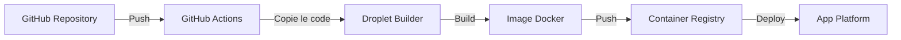

# Déploiement sur DigitalOcean

Ce document explique comment déployer le système Evil2Root Trading Bot sur DigitalOcean App Platform en utilisant une architecture de build séparée.

## Architecture

Le système utilise une architecture qui sépare le processus de build de l'exécution :



Cette architecture offre plusieurs avantages :
- Évite les problèmes de mémoire lors du build (OOM errors)
- Permet des builds plus rapides sur une machine dédiée
- Sépare les préoccupations entre build et exécution
- Plus économique sur le long terme

## Configuration initiale (À FAIRE UNE SEULE FOIS)

### Étape 1: Exécuter le script de configuration

```bash
# Assurez-vous que le script est exécutable
chmod +x scripts/setup-builder-droplet.sh

# Exécutez le script avec votre token DigitalOcean
./scripts/setup-builder-droplet.sh VOTRE_TOKEN_DIGITALOCEAN
```

Ce script va:
1. Créer une Droplet DigitalOcean (serveur de build)
2. Configurer un Container Registry
3. Initialiser l'environnement de build
4. Vous fournir les valeurs nécessaires pour les secrets GitHub

### Étape 2: Configurer les secrets GitHub

Dans votre repository GitHub, allez dans Settings > Secrets and variables > Actions et ajoutez les secrets suivants:

- `DIGITALOCEAN_ACCESS_TOKEN`: Votre token DigitalOcean
- `BUILDER_IP`: L'adresse IP de la Droplet (fournie par le script)
- `BUILDER_SSH_KEY`: Votre clé SSH privée
- `BUILDER_HOST_KEY`: L'empreinte de la Droplet (obtenue via `ssh-keyscan IP_DROPLET`)

### Étape 3: Déployer initialement sur App Platform

```bash
# Authentifiez-vous à DigitalOcean
doctl auth init

# Déployez l'application
doctl apps create --spec .do/app.yaml
```

## Workflow automatique

Une fois la configuration initiale terminée, le workflow devient entièrement automatique:

1. Lorsque vous poussez du code sur la branche `main`
2. GitHub Actions est déclenché automatiquement
3. Le code est copié sur la Droplet builder
4. L'image Docker est construite et poussée vers le Container Registry
5. L'application est mise à jour sur App Platform

## Maintenance

### Vérifier l'état du builder

```bash
# Vérifiez que la Droplet fonctionne
ssh root@IP_DROPLET 'uptime'

# Vérifiez l'espace disque disponible
ssh root@IP_DROPLET 'df -h'

# Vérifiez les logs Docker
ssh root@IP_DROPLET 'docker logs -f $(docker ps -q)'
```

### Nettoyer les images et conteneurs inutilisés

```bash
ssh root@IP_DROPLET 'docker system prune -af'
```

### Reconstruire manuellement l'image

```bash
ssh root@IP_DROPLET '/opt/builder/build.sh'
```

## Dépannage

### Problèmes de build

Si le build échoue sur la Droplet:

1. Vérifiez les logs:
   ```bash
   ssh root@IP_DROPLET 'cd /opt/builder && ls -la'
   ```

2. Assurez-vous que la Droplet a suffisamment de ressources:
   ```bash
   ssh root@IP_DROPLET 'free -h && df -h'
   ```

### Problèmes de déploiement

Si le déploiement sur App Platform échoue:

1. Vérifiez que l'image existe dans le Container Registry:
   ```bash
   doctl registry repository list-tags evil2root-registry/evil2root-ai
   ```

2. Vérifiez les logs de l'application:
   ```bash
   APP_ID=$(doctl apps list --format ID,Spec.Name | grep evil2root-ai | awk '{print $1}')
   doctl apps logs $APP_ID
   ```

## Remarque importante

⚠️ **Le script `setup-builder-droplet.sh` ne doit être exécuté qu'une seule fois** lors de la configuration initiale. L'exécuter à nouveau créerait une nouvelle Droplet, ce qui n'est pas nécessaire et entraînerait des coûts supplémentaires. 