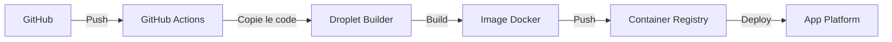

# 🤖 EVIL2ROOT Trading Bot - Documentation complète

## 📚 Table des matières

1. [Introduction](#introduction)
2. [Architecture du système](#architecture-du-système)
3. [Fonctionnalités principales](#fonctionnalités-principales)
4. [Structure du projet](#structure-du-projet)
5. [Modèles d'IA intégrés](#modèles-dia-intégrés)
6. [Configuration et déploiement](#configuration-et-déploiement)
7. [API et services](#api-et-services)
8. [Monitoring et alertes](#monitoring-et-alertes)
9. [Backtesting](#backtesting)
10. [Guide du développeur](#guide-du-développeur)
11. [Dépannage](#dépannage)
12. [Feuille de route](#feuille-de-route)

## Introduction

EVIL2ROOT Trading Bot est une plateforme de trading automatisé sophistiquée qui exploite l'IA avancée, l'analyse technique et l'analyse de sentiment pour générer des signaux de trading optimaux sur divers marchés financiers. Le système se distingue par sa couche de validation IA qui utilise Claude 3.7 pour analyser chaque décision de trading en fonction de multiples facteurs, garantissant ainsi des décisions plus robustes et fiables.

La plateforme est conçue avec une architecture microservices évolutive, permettant un déploiement fluide sur des environnements modernes comme Docker, Kubernetes, ou des plateformes cloud comme DigitalOcean et Railway.

### Objectifs principaux

- **Trading automatisé intelligent** : Combiner différentes stratégies et sources de données pour des décisions de trading optimales
- **Architecture évolutive** : Système modulaire facilement extensible et adaptable aux évolutions du marché
- **Sécurité renforcée** : Protection des données et des actifs avec des mesures de sécurité avancées
- **Surveillance en temps réel** : Interface web intuitive et alertes instantanées

## Architecture du système

EVIL2ROOT Trading Bot est structuré selon une architecture microservices moderne, offrant une scalabilité optimale et une maintenance facilitée.

### Vue d'ensemble

```
┌─────────────────┐    ┌─────────────────┐    ┌─────────────────┐
│                 │    │                 │    │                 │
│   Trading Bot   │◄──►│  AI Validator   │◄──►│     Web UI      │
│                 │    │                 │    │                 │
└────────┬────────┘    └────────┬────────┘    └────────┬────────┘
         │                      │                      │
         ▼                      ▼                      ▼
┌─────────────────────────────────────────────────────────────┐
│                                                             │
│                     Redis Message Bus                       │
│                                                             │
└───────────────────────────┬─────────────────────────────────┘
                            │
                            ▼
┌─────────────────────────────────────────────────────────────┐
│                                                             │
│                   PostgreSQL Database                       │
│                                                             │
└─────────────────────────────────────────────────────────────┘
```

### Composants principaux

- **Trading Bot** : Moteur principal qui exécute les stratégies de trading
- **AI Validator** : Service qui valide les décisions de trading avec des modèles IA avancés
- **Redis Message Bus** : Système de messagerie en temps réel pour la communication entre services
- **PostgreSQL Database** : Stockage persistant pour les données, les journaux et les configurations
- **Web UI** : Interface utilisateur pour la surveillance et la configuration

### Architecture de déploiement

Le bot utilise une architecture optimisée qui sépare le processus de build de l'exécution, particulièrement adaptée pour les déploiements sur DigitalOcean et Railway :



Cette architecture offre plusieurs avantages :
- Évite les problèmes de mémoire lors du build (OOM errors)
- Permet des builds plus rapides sur une machine dédiée
- Sépare les préoccupations entre build et exécution
- Plus économique sur le long terme

## Fonctionnalités principales

### 🔮 Prédiction et Analyse

- **Prédiction de Prix Avancée** : Modèles LSTM, GRU et Transformer pour l'analyse de séries temporelles
- **Analyse Technique Automatisée** : Plus de 50 indicateurs calculés et analysés en temps réel
- **Analyse de Sentiment** : Traitement du langage naturel sur les actualités financières et les médias sociaux
- **Détection de Patterns** : Reconnaissance automatique des figures chartistes et configurations de prix

### 🛡️ Gestion des Risques

- **Sizing Dynamique** : Ajustement automatique de la taille des positions selon le risque
- **Stop-Loss Intelligents** : Placement optimal des stops basé sur la volatilité et les supports/résistances
- **Take-Profit Adaptatifs** : Objectifs de profit ajustés selon les conditions de marché
- **Trailing Stops** : Suivi dynamique des positions gagnantes pour maximiser les profits

### 🔍 Validation et Décision

- **Double Validation IA** : Chaque signal est validé par un système IA secondaire
- **Analyse Multi-actifs** : Corrélations entre marchés pour des décisions plus robustes
- **Filtres de Volatilité** : Protection contre les mouvements erratiques du marché
- **Scores de Confiance** : Attribution de niveaux de confiance à chaque signal généré

### 📱 Interface et Notifications

- **Dashboard en Temps Réel** : Visualisation claire de toutes les positions et analyses
- **Notifications Configurables** : Alertes Telegram pour chaque action importante
- **Journalisation Détaillée** : Historique complet des transactions et des décisions
- **Rapports d'Analyse** : Génération automatique de rapports quotidiens et hebdomadaires

### 🤖 Apprentissage par Renforcement (RL)

- **Agents spécialisés par régime de marché** : Des agents RL sont entraînés pour différents régimes de marché (volatile, stable, bullish, bearish)
- **Multiples algorithmes** : Support pour PPO, SAC et TD3
- **Implémentation PyTorch personnalisée** : Performance optimisée et contrôle total sur les modèles

## Structure du projet

```
EVIL2ROOT_AI-main/
│
├── src/                    # Code source principal
│   ├── core/               # Fonctionnalités principales et moteur de trading
│   ├── models/             # Modèles d'IA et de prédiction
│   ├── services/           # Services divers (notifications, paiements)
│   ├── api/                # API et endpoints
│   ├── utils/              # Utilitaires communs
│   └── ui/                 # Interface utilisateur
│
├── app/                    # Applications et scripts spécifiques
│   ├── models/             # Modèles spécifiques aux applications
│   ├── api/                # API spécifiques aux applications
│   ├── plugins/            # Système de plugins extensible
│   ├── services/           # Services spécifiques aux applications
│   ├── routes/             # Routes pour les interfaces web
│   ├── scripts/            # Scripts utilitaires
│   ├── static/             # Fichiers statiques pour le frontend
│   └── templates/          # Templates pour les interfaces web
│
├── config/                 # Fichiers de configuration
│   └── environments/       # Configurations spécifiques aux environnements
│
├── tests/                  # Tests unitaires et d'intégration
├── docs/                   # Documentation
├── docker/                 # Fichiers Docker
├── kubernetes/             # Configuration Kubernetes
├── scripts/                # Scripts utilitaires
├── monitoring/             # Outils de surveillance
├── migrations/             # Migrations de base de données
└── logs/                   # Répertoire pour les journaux
```

## Modèles d'IA intégrés

### 🔄 Modèles Prédictifs
- **LSTM & GRU** : Réseaux récurrents pour la prévision de mouvements de prix
- **Transformer** : Architecture d'attention pour l'analyse de séquences temporelles
- **Conv1D** : Réseaux convolutifs pour la détection de patterns dans les graphiques

### 📊 Modèles d'Analyse Technique
- **Modèles d'Ensemble** : Random Forest et XGBoost pour l'analyse d'indicateurs
- **Détecteurs de Patterns** : Reconnaissance des figures chartistes classiques
- **Analyseurs de Tendance** : Identification des phases de marché et retournements

### 📰 Modèles d'Analyse de Sentiment
- **BERT & RoBERTa** : Modèles de langage pour l'analyse d'actualités financières
- **SentenceTransformer** : Extraction de sentiment à partir des médias sociaux
- **Analyseur de Volatilité Implicite** : Évaluation de la peur/avidité du marché

### 🤖 Validation IA
- **Claude 3.7** : Grand modèle de langage pour la validation avancée des décisions
- **Système de plugins extensible** : Architecture permettant d'ajouter facilement de nouveaux modèles

## Configuration et déploiement

### Prérequis

- Python 3.8+ (3.9 recommandé)
- Docker et Docker Compose (pour déploiement containerisé)
- PostgreSQL 13+
- Redis 6+
- Clés API pour les services externes (TA-Lib, Claude/Anthropic, etc.)

### Installation locale

1. Cloner le dépôt
```bash
git clone https://github.com/votre-username/EVIL2ROOT_AI.git
cd EVIL2ROOT_AI
```

2. Installer les dépendances
```bash
pip install -r requirements.txt
```

3. Configurer les variables d'environnement
```bash
cp config/secrets.env config/secrets.env.local
# Éditer config/secrets.env.local avec vos clés API
```

4. Lancer l'application
```bash
python src/main.py --mode paper
```

### Déploiement avec Docker

```bash
docker build -t trading-bot:latest .
docker run -d --name trading-bot \
  --env-file config/secrets.env.local \
  -v $(pwd)/data:/app/data \
  -v $(pwd)/logs:/app/logs \
  -v $(pwd)/saved_models:/app/saved_models \
  trading-bot:latest
```

### Déploiement sur Railway

1. Configurez le webhook dans Railway
   - URL: https://railway.app/project/YOUR_PROJECT_ID/service/YOUR_SERVICE_ID/settings
   - Webhook Type: Build
   - Utilisez `railway-build-webhook.sh` comme script de build

2. Configurez les variables d'environnement dans Railway
   - Ajoutez toutes les variables nécessaires dans l'interface Railway

3. Déployez le projet
   - Connectez votre dépôt GitHub à Railway
   - Railway déploiera automatiquement à chaque push

### Déploiement sur DigitalOcean

1. Exécutez le script de configuration une seule fois
```bash
./scripts/setup-builder-droplet.sh VOTRE_TOKEN_DIGITALOCEAN
```

2. Configurez les secrets GitHub Actions
   - `DIGITALOCEAN_ACCESS_TOKEN`: Votre token DigitalOcean
   - `BUILDER_IP`: L'adresse IP de la Droplet
   - `BUILDER_SSH_KEY`: Votre clé SSH privée
   - `BUILDER_HOST_KEY`: L'empreinte de la Droplet

3. Déployez sur App Platform
```bash
doctl auth init
doctl apps create --spec .do/app.yaml
```

## API et services

### API RESTful

Le bot expose une API RESTful complète pour l'intégration avec des systèmes externes :

- `/api/v1/auth` - Authentification et gestion des utilisateurs
- `/api/v1/trading` - Endpoints pour les opérations de trading
- `/api/v1/subscriptions` - Gestion des abonnements
- `/api/v1/stats` - Statistiques et analyses de performance

### Services principaux

- **Trading System** : Moteur principal de trading
- **AI Validator** : Service de validation des décisions de trading
- **Notification Service** : Service d'envoi de notifications
- **Market Data Service** : Récupération et traitement des données de marché
- **Subscription Manager** : Gestion des abonnements et des paiements

## Monitoring et alertes

### Dashboards

- **Trading Dashboard** : Vue d'ensemble des positions, performances et signaux
- **Performance Dashboard** : Analyse détaillée des performances de trading
- **System Dashboard** : Surveillance de l'état du système et de ses composants

### Alertes

- **Alertes Telegram** : Notifications en temps réel pour les événements de trading
- **Alertes Email** : Rapports quotidiens et hebdomadaires
- **Alertes Système** : Notifications pour les problèmes techniques

## Backtesting

Le système inclut un moteur de backtesting robuste pour tester les stratégies sur des données historiques :

```bash
python src/main.py --mode backtest --symbol BTCUSDT --start-date 2023-01-01 --end-date 2023-12-31 --strategy hybrid
```

Options disponibles :
- `--strategy` : Choisissez parmi `technical`, `sentiment`, `rl`, ou `hybrid`
- `--symbol` : Le symbole à tester
- `--timeframe` : Période temporelle (1h, 4h, 1d, etc.)
- `--config` : Chemin vers un fichier de configuration personnalisé

### Métriques d'évaluation

- **Performance globale** : ROI, profit total, nombre de trades
- **Métriques de risque** : Sharpe ratio, Sortino ratio, drawdown maximum
- **Analyse temporelle** : Performance mensuelle, annuelle, par régime de marché
- **Visualisations** : Graphiques de performance, distribution des trades, heatmaps

## Guide du développeur

### Architecture du code

- **Core** : Contient le moteur de trading principal et les fonctionnalités essentielles
- **Models** : Contient tous les modèles d'IA et d'apprentissage automatique
- **Services** : Services indépendants pour diverses fonctionnalités
- **API** : Interfaces pour les applications externes
- **Utils** : Fonctions utilitaires réutilisables

### Ajout de nouvelles fonctionnalités

1. **Nouveaux modèles** : Ajoutez de nouveaux modèles dans `src/models/`
2. **Nouvelles stratégies** : Créez de nouvelles stratégies dans `src/core/strategies/`
3. **Nouveaux indicateurs** : Ajoutez des indicateurs dans `src/core/indicators/`

### Bonnes pratiques

- Suivez les conventions de nommage existantes
- Ajoutez des tests unitaires pour les nouvelles fonctionnalités
- Documentez le code avec des docstrings
- Utilisez le typing pour les annotations de type

## Dépannage

### Problèmes courants

1. **Erreurs TA-Lib** : 
   - Utilisez les scripts dans `docker/` pour une installation correcte
   - En cas d'échec, le système bascule sur une implémentation mock

2. **Erreurs de connexion à la base de données** :
   - Vérifiez les paramètres de connexion dans les variables d'environnement
   - Assurez-vous que PostgreSQL est en cours d'exécution
   - Vérifiez les logs pour les erreurs spécifiques

3. **Erreurs de mémoire lors du build** :
   - Utilisez l'architecture de build séparée décrite dans la section déploiement
   - Augmentez la mémoire allouée à Docker si vous construisez localement

4. **Problèmes d'API externes** :
   - Vérifiez la validité des clés API
   - Surveillez les quotas d'utilisation des API
   - Implémentez des retries avec backoff exponentiel

## Feuille de route

### Prochaines fonctionnalités

- **Intégration avec plus d'échanges** : Support pour Kraken, Bitfinex, FTX
- **Stratégies avancées de RL** : Agents de trading par renforcement plus sophistiqués
- **Interface utilisateur améliorée** : Dashboard plus intuitif et personnalisable
- **Expansion des actifs** : Support pour les actions traditionnelles et les forex
- **Optimisation des performances** : Réduction de la latence et amélioration de l'efficacité
- **Automatisation du calibrage** : Auto-calibrage des modèles basé sur les performances historiques

---

## 📝 Licence

Ce projet est sous licence MIT. Voir le fichier LICENSE pour plus de détails.

## ⚠️ Avertissement

Le trading financier comporte des risques significatifs. Ce bot est fourni à des fins éducatives et de recherche uniquement. Les performances passées ne garantissent pas les résultats futurs.
