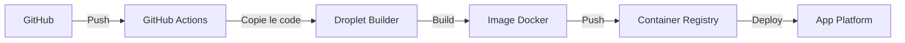

# 🤖 EVIL2ROOT Trading Bot 📈

<div align="center">


[](https://opensource.org/licenses/MIT)
[](https://www.python.org/downloads/)
[](https://www.docker.com/)
[](https://www.postgresql.org/)
[](https://www.tensorflow.org/)
[](https://claude.ai/)

**Un système de trading automatisé complet avec validation des décisions par IA, 
apprentissage par renforcement et analyse du sentiment de marché.**

</div>

## 🌟 Points Forts

- **Intelligence Artificielle Avancée** : Utilisation de modèles d'ensemble combinant apprentissage profond, réseaux de neurones et LLM pour des analyses multidimensionnelles
- **Analyse de Sentiment Multi-sources** : Traitement en temps réel des actualités, médias sociaux et rapports financiers
- **Architecture Évolutive** : Système modulaire facilement extensible et adaptable aux changements de marché
- **Backtesting Robuste** : Simulation précise sur données historiques avec ajustement pour la liquidité et le slippage
- **Performance Optimisée** : Trading haute fréquence avec latence minimisée et exécution efficace
- **Sécurité Renforcée** : Chiffrement bout-en-bout, authentification à deux facteurs et audit de sécurité
- **Multi-exchange Support** : Compatible avec les principales plateformes d'échange (Binance, Coinbase, FTX, etc.)
- **Multi-actifs** : Trading sur cryptomonnaies, actions, forex, matières premières et dérivés
- **API Complète** : Intégration facile avec des systèmes externes via une API RESTful documentée
- **Gestion Dynamique des Risques** : Calcul intelligent des tailles de position et niveaux stop-loss/take-profit
- **Surveillance en Temps Réel** : Interface web intuitive avec tableaux de bord complets et alertes instantanées
- **Support ARM64 Natif** : Optimisé pour Apple Silicon (M1/M2/M3) avec builds spécifiques à l'architecture

## 🚀 Architecture de Déploiement

Le bot utilise une architecture optimisée pour DigitalOcean qui sépare le build de l'exécution :



### Configuration initiale (à faire UNE SEULE FOIS)

Pour mettre en place l'environnement de build :

```bash
# Exécuter UNE SEULE FOIS pour configurer l'environnement
./scripts/setup-builder-droplet.sh VOTRE_TOKEN_DIGITALOCEAN
```

Ce script va :
1. Créer une Droplet DigitalOcean dédiée au build
2. Configurer un Container Registry
3. Préparer les secrets pour GitHub Actions

### Workflow automatique à chaque push

Une fois la configuration initiale terminée, à chaque push sur la branche main :

1. GitHub Actions déclenche le build sur la Droplet existante
2. L'image Docker est construite et poussée vers le Container Registry
3. App Platform déploie automatiquement la nouvelle version

⚠️ **Important** : Le script `setup-builder-droplet.sh` ne doit être exécuté qu'une seule fois lors de la configuration initiale.

---

## 📋 Table des Matières

- [🚀 Présentation](#-présentation)
- [✨ Fonctionnalités](#-fonctionnalités)
- [🏗️ Architecture du Système](#️-architecture-du-système)
- [🧠 Modèles IA Intégrés](#-modèles-ia-intégrés)
- [🚦 Pour Commencer](#-pour-commencer)
- [🎮 Guide d'Utilisation](#-guide-dutilisation)
- [⚙️ Configuration](#️-configuration)
- [📊 Visualisation et Surveillance](#-visualisation-et-surveillance)
- [📚 Documentation](#-documentation)
- [💻 Développement](#-développement)
- [📝 Licence](#-licence)
- [⚠️ Avertissement](#️-avertissement)

---

## 🚀 Présentation

EVIL2ROOT Trading Bot est une plateforme de trading automatisé conçue pour exploiter les dernières avancées en intelligence artificielle, en traitement des données et en analyse de marché. Le système exploite les synergies entre l'analyse technique traditionnelle, le deep learning et l'analyse de sentiment pour générer des signaux de trading robustes et fiables.

Ce qui distingue EVIL2ROOT des autres solutions de trading est sa couche de validation IA qui utilise Claude 3.7 pour analyser et vérifier chaque décision de trading en fonction de multiples facteurs (conditions de marché, données macroéconomiques, actualités financières et plus encore).

<div align="center">
  
  <p><em>Interface de trading intuitive avec analyse en temps réel</em></p>
</div>

---

## ✨ Fonctionnalités

### 🔮 Prédiction et Analyse
- **Prédiction de Prix Avancée** : Modèles LSTM, GRU et Transformer pour l'analyse de séries temporelles
- **Analyse Technique Automatisée** : Plus de 50 indicateurs calculés et analysés en temps réel
- **Analyse de Sentiment** : Traitement du langage naturel sur les actualités financières et les médias sociaux
- **Détection de Patterns** : Reconnaissance automatique des figures chartistes et configurations de prix

### 🛡️ Gestion des Risques
- **Sizing Dynamique** : Ajustement automatique de la taille des positions selon le risque
- **Stop-Loss Intelligents** : Placement optimal des stops basé sur la volatilité et les supports/résistances
- **Take-Profit Adaptatifs** : Objectifs de profit ajustés selon les conditions de marché
- **Trailing Stops** : Suivi dynamique des positions gagnantes pour maximiser les profits

### 🔍 Validation et Décision
- **Double Validation IA** : Chaque signal est validé par un système IA secondaire
- **Analyse Multi-actifs** : Corrélations entre marchés pour des décisions plus robustes
- **Filtres de Volatilité** : Protection contre les mouvements erratiques du marché
- **Scores de Confiance** : Attribution de niveaux de confiance à chaque signal généré

### 📱 Interface et Notifications
- **Dashboard en Temps Réel** : Visualisation claire de toutes les positions et analyses
- **Notifications Configurables** : Alertes Telegram pour chaque action importante
- **Journalisation Détaillée** : Historique complet des transactions et des décisions
- **Rapports d'Analyse** : Génération automatique de rapports quotidiens et hebdomadaires

---

## 🏗️ Architecture du Système

EVIL2ROOT Trading Bot est structuré selon une architecture microservices moderne, permettant une scalabilité optimale et une maintenance facilitée.

```
┌─────────────────┐    ┌─────────────────┐    ┌─────────────────┐
│                 │    │                 │    │                 │
│   Trading Bot   │◄──►│  AI Validator   │◄──►│     Web UI      │
│                 │    │                 │    │                 │
└────────┬────────┘    └────────┬────────┘    └────────┬────────┘
         │                      │                      │
         ▼                      ▼                      ▼
┌─────────────────────────────────────────────────────────────┐
│                                                             │
│                     Redis Message Bus                       │
│                                                             │
└───────────────────────────┬─────────────────────────────────┘
                            │
                            ▼
┌─────────────────────────────────────────────────────────────┐
│                                                             │
│                   PostgreSQL Database                       │
│                                                             │
└─────────────────────────────────────────────────────────────┘
```

### 📂 Nouvelle Structure du Projet

Nous avons récemment restructuré le projet pour améliorer son organisation et sa maintenabilité :

```
EVIL2ROOT_AI-main/
│
├── src/                    # Code source principal
│   ├── core/               # Fonctionnalités principales et moteur de trading
│   ├── models/             # Modèles d'IA et de prédiction
│   ├── services/           # Services divers (notifications, paiements)
│   ├── api/                # API et endpoints
│   ├── utils/              # Utilitaires communs
│   └── ui/                 # Interface utilisateur
│
├── tests/                  # Tests unitaires et d'intégration
├── config/                 # Fichiers de configuration
├── scripts/                # Scripts utilitaires
├── docs/                   # Documentation
├── docker/                 # Fichiers Docker
└── kubernetes/             # Configuration Kubernetes
```

Pour plus de détails sur la structure, consultez [le document de restructuration](docs/NOUVELLE_STRUCTURE.md).

---

## 🧠 Modèles IA Intégrés

### 🔄 Modèles Prédictifs
- **LSTM & GRU** : Réseaux récurrents pour la prévision de mouvements de prix
- **Transformer** : Architecture d'attention pour l'analyse de séquences temporelles
- **Conv1D** : Réseaux convolutifs pour la détection de patterns dans les graphiques

### 📊 Modèles d'Analyse Technique
- **Modèles d'Ensemble** : Random Forest et XGBoost pour l'analyse d'indicateurs
- **Détecteurs de Patterns** : Reconnaissance des figures chartistes classiques
- **Analyseurs de Tendance** : Identification des phases de marché et retournements

### 📰 Modèles d'Analyse de Sentiment
- **BERT & RoBERTa** : Modèles de langage pour l'analyse d'actualités financières
- **SentenceTransformer** : Extraction de sentiment à partir des médias sociaux
- **Analyseur de Volatilité Implicite** : Évaluation de la peur/avidité du marché

### 🤖 Validation IA
- **Claude 3.7** : Grand modèle de langage pour la validation avancée des décisions
- **Système de Raisonnement Critique** : Évaluation multi-facteurs des opportunités
- **Analyseur de Contexte Macro** : Prise en compte des facteurs économiques globaux

<div align="center">
  
  <p><em>Architecture des modèles IA intégrés</em></p>
</div>

---

## 🚦 Pour Commencer

### 📋 Prérequis
- Docker et Docker Compose
- Python 3.8+ (pour le développement local)
- Compte OpenRouter pour l'API Claude (validation IA)
- Minimum 8GB de RAM recommandé (16GB pour l'entraînement des modèles)

### 🔧 Installation Standard

1. Clonez le dépôt :
   ```bash
   git clone https://github.com/EpicSanDev/EVIL2ROOT_AI-main.git
   cd EVIL2ROOT_AI-main
   ```

2. Exécutez le script d'installation :
   ```bash
   chmod +x install.sh
   ./install.sh
   ```

3. Configurez votre environnement :
   ```bash
   # Modifiez le fichier .env avec vos paramètres
   nano .env
   ```

4. Lancez l'application :
   ```bash
   source venv/bin/activate
   python src/main.py
   ```

### 🐳 Installation avec Docker

1. Clonez le dépôt et configurez l'environnement :
   ```bash
   git clone https://github.com/EpicSanDev/EVIL2ROOT_AI-main.git
   cd EVIL2ROOT_AI-main
   cp config/environments/.env.example .env
   ```

2. Personnalisez votre configuration :
   ```bash
   # Modifiez le fichier .env avec vos paramètres
   nano .env
   ```

3. Démarrez avec Docker Compose :
   ```bash
   cd docker
   docker-compose up -d
   ```

---

## 🎮 Guide d'Utilisation

### 💻 Interface Web
Accédez à l'interface web à l'adresse http://localhost:5000/ pour :
- Visualiser le tableau de bord des performances
- Consulter l'historique des transactions
- Configurer les paramètres du bot
- Surveiller les positions ouvertes

### 🚀 Modes d'Exécution
- **Mode Paper Trading** :
  ```bash
  python src/main.py --mode paper
  ```

- **Mode Backtest** :
  ```bash
  python src/main.py --mode backtest
  ```

- **Mode Trading Réel** (à utiliser avec précaution) :
  ```bash
  python src/main.py --mode live
  ```

- **Mode Analyse de Marché** :
  ```bash
  python src/main.py --mode analysis
  ```

### 🔄 Options Avancées
- **Entraînement Forcé des Modèles** :
  ```bash
  python src/main.py --force-train
  ```

- **Sélection de Symboles Spécifiques** :
  ```bash
  python src/main.py --symbols BTC-USD,ETH-USD,AAPL
  ```

- **Mode Debug** :
  ```bash
  python src/main.py --debug
  ```

---

## ⚙️ Configuration

### 📝 Paramètres Principaux
Les principales configurations se trouvent dans le fichier `.env` :

| Paramètre | Description | Valeur par défaut |
|-----------|-------------|-------------------|
| `ENABLE_LIVE_TRADING` | Active le trading réel | `false` |
| `RISK_PER_TRADE` | % du capital par trade | `0.02` |
| `CONFIDENCE_THRESHOLD` | Seuil de confiance IA | `0.65` |
| `SYMBOLS` | Symboles à trader | `BTC-USD,ETH-USD,AAPL...` |
| `TELEGRAM_TOKEN` | Token bot Telegram | - |
| `OPENROUTER_API_KEY` | Clé API pour Claude | - |
| `CLAUDE_MODEL` | Version de Claude | `anthropic/claude-3.7-sonnet` |

### 🧮 Configuration des Modèles
Personnalisez les paramètres des modèles dans les fichiers de configuration dédiés :
- `config/models/price_prediction.json`

# Configuration des secrets GitHub Actions

Pour assurer le déploiement automatique de l'application vers DigitalOcean Kubernetes, ajoutez les secrets suivants dans les paramètres de votre dépôt GitHub (Settings > Secrets and variables > Actions > New repository secret):

1. **DIGITALOCEAN_ACCESS_TOKEN** : Votre token d'accès personnel DigitalOcean avec les permissions nécessaires pour:
   - Créer et gérer des clusters Kubernetes
   - Pousser des images dans le registre DigitalOcean
   - Créer et gérer des ressources associées

2. **NOTIFICATION_EMAIL** : L'adresse e-mail à utiliser pour les notifications et l'authentification au registre

Secrets optionnels (valeurs par défaut utilisées si non définis):
- **DB_USER** : Nom d'utilisateur de la base de données (défaut: postgres)
- **DB_PASSWORD** : Mot de passe de la base de données (défaut: changeme)
- **DB_NAME** : Nom de la base de données (défaut: tradingbot)
- **REDIS_PASSWORD** : Mot de passe Redis (défaut: changeme)
- **GRAFANA_ADMIN_USER** : Utilisateur administrateur Grafana (défaut: admin)
- **GRAFANA_ADMIN_PASSWORD** : Mot de passe administrateur Grafana (défaut: admin)

Pour une utilisation en production, assurez-vous de définir des mots de passe sécurisés pour tous ces secrets.

# Fonctionnement du déploiement automatique

Une fois les secrets configurés, chaque push sur la branche `main` déclenchera automatiquement:
1. La construction et le push de l'image Docker vers le registre DigitalOcean
2. La création du cluster Kubernetes s'il n'existe pas déjà
3. Le déploiement de toutes les ressources nécessaires (deployments, services, ingress, etc.)
4. La mise à jour du fichier ACCESS.md avec l'adresse IP du service

Vous pouvez suivre le processus de déploiement dans l'onglet "Actions" de votre dépôt GitHub.

# EVIL2ROOT Trading Bot - Service Web Complet

Un service web complet pour le bot de trading EVIL2ROOT, comprenant une API RESTful et une interface utilisateur moderne.

## Fonctionnalités

- **API RESTful complète** pour interagir avec le bot de trading
- **Interface utilisateur moderne** développée avec React et Material UI
- **Tableau de bord de trading** avec visualisation en temps réel
- **Gestion des utilisateurs** avec authentification sécurisée
- **Système d'abonnement** avec différents niveaux de service
- **Backtesting** pour tester vos stratégies sur des données historiques
- **Analyses de performance** détaillées
- **Notifications** par email et dans l'application

## Architecture

Le projet est organisé en plusieurs composants :

- **API** : API FastAPI pour interagir avec le système
- **Backend** : Logique métier et intégration avec les plateformes d'échange
- **Frontend** : Interface utilisateur React/TypeScript pour la configuration et le monitoring
- **Base de données** : PostgreSQL pour stocker les données utilisateurs, les configurations et les résultats de trading

## Prérequis

- Python 3.10+
- Node.js 16+
- PostgreSQL 14+
- Docker (optionnel)

## Installation

### Configuration de la base de données

1. Installez PostgreSQL si ce n'est pas déjà fait :

```bash
# Sur Ubuntu/Debian
sudo apt-get update
sudo apt-get install postgresql postgresql-contrib

# Sur macOS avec Homebrew
brew install postgresql
```

2. Créez une base de données pour le projet :

```bash
sudo -u postgres psql
CREATE DATABASE evil2root;
CREATE USER evil2root_user WITH ENCRYPTED PASSWORD 'your_password';
GRANT ALL PRIVILEGES ON DATABASE evil2root TO evil2root_user;
\q
```

### Backend

1. Clonez le dépôt :

```bash
git clone https://github.com/yourusername/EVIL2ROOT_AI.git
cd EVIL2ROOT_AI
```

2. Créez et activez un environnement virtuel :

```bash
python -m venv venv
source venv/bin/activate  # Sur Windows : venv\Scripts\activate
```

3. Installez les dépendances :

```bash
pip install -r requirements.txt
```

4. Configurez les variables d'environnement :

```bash
cp .env.example .env
# Éditez le fichier .env selon votre configuration
```

5. Initialisez la base de données :

```bash
# Pour initialiser la base de données
python -m src.api.run_api --init-db

# Pour exécuter les migrations
alembic upgrade head
```

### Installation avec Docker

1. Construction de l'image Docker standard :

```bash
make build
# ou
docker compose build
```

2. Construction avec surveillance anti-timeout (recommandé pour CI/CD) :

```bash
make build-monitored
# ou
./monitor-build.sh --timeout 60  # Timeout en minutes
```

3. Construction optimisée pour éviter les timeouts :

```bash
make build-fast
# ou
./build-docker.sh --use-mock-talib
```

4. Constructions spécifiques pour ARM64 (Apple Silicon) :

```bash
# Construction optimisée pour ARM64
make build-arm64
# ou
./docker/build-arm64.sh

# Construction rapide avec mock TA-Lib pour ARM64
make build-arm64-mock
# ou
./docker/build-arm64.sh --use-mock-talib

# Construction minimale pour ARM64
make build-arm64-minimal
# ou
./docker/build-arm64.sh --essential-only
```

5. Recommandation automatique de la meilleure méthode de build :

```bash
# Obtenir une recommandation personnalisée basée sur votre système
make recommend-build
# ou
./recommend-build.sh
```

Pour plus de détails sur les builds ARM64, consultez [ARM64_BUILD_GUIDE.md](ARM64_BUILD_GUIDE.md).

5. Lancement du conteneur :

6. Lancez l'API :

```bash
python -m src.api.run_api
```

### Frontend

1. Installez les dépendances :

```bash
cd frontend
npm install
```

2. Lancez l'application en mode développement :

```bash
npm start
```

## Utilisation avec Docker

Un fichier docker-compose.yml est fourni pour faciliter le déploiement :

```bash
docker-compose up -d
```

## Structure de la base de données

La base de données est organisée selon le schéma suivant :

- **users** : Informations sur les utilisateurs
- **userpreferences** : Préférences des utilisateurs
- **passwordresettokens** : Tokens de réinitialisation de mot de passe
- **subscriptions** : Définition des plans d'abonnement
- **usersubscriptions** : Abonnements souscrits par les utilisateurs
- **payments** : Paiements effectués pour les abonnements
- **exchanges** : Informations sur les plateformes d'échange
- **symbols** : Symboles (paires de trading) disponibles
- **tradingaccounts** : Comptes de trading des utilisateurs
- **tradingstrategys** : Stratégies de trading configurées
- **trades** : Transactions effectuées
- **backtestresults** : Résultats des backtests de stratégies

## API Documentation

La documentation de l'API est disponible à l'adresse suivante une fois l'API lancée :

```
http://localhost:8000/docs
```

## Développement

### Migrations de base de données

Pour créer une nouvelle migration après avoir modifié les modèles :

```bash
alembic revision --autogenerate -m "Description du changement"
```

Pour appliquer les migrations :

```bash
alembic upgrade head
```

### Tests

Pour exécuter les tests :

```bash
pytest
```

## Licence

Ce projet est sous licence [MIT](LICENSE).

## Contact

Pour toute question ou suggestion, veuillez nous contacter à info@evil2root.com